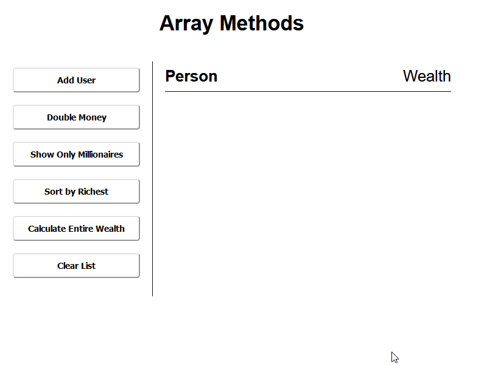

# Array Methods
A simple project that uses higher order array methods like map, reduce, filter, and sort by fetching fake users from the randomuser.me API using the async/await syntax, and then operating on the mock data with the aforementioned array methods. 

## Project Preview


[LIVE DEMO](https://kelenam.github.io/js-array-methods/)

## How to Install
- `git clone` this repo
- No hard dependencies required to run so no need for `npm/yarn` installs. 
- Just open the `index.html` file or use server of your choice.
- Note: If modifying the file, and you have TS already installed, you can just call `tsc --watch` in the root project directory to compile your js into appropriate dir.
- I'd recommend using the VSCode Sass Plugin as well.  

## Project Notes
Using the `document.createElement('div')` to create new divs, or any element for that matter. If we are using Divs we are set the inner content or text of that newly created div by using `innerHTML`. Then appending the new element as a child of whatever element we want to append it to.

When we are using the destructuring syntax in our `doubleMoney` function...
```ts
function doubleMoney(): void {
    userList = userList.map((user: any): {name: string, money: string} => {
        return { ...user, money: user.money * 2 }
    });
    updateDOM();
}
```
The reason we use destructuring, is that it takes all the existing data from the `user` object we are passing in, all proerties so on and so forth in that object even though at the moment there is only `name` and `money` as properties. If we had more than the properties mentioned they would be inclucded in our destructuring, although since we are using TS, if we wanted to stay explicit about our type declarations we should specify them there. I suppose if we are using TS in this case, as we are above, it might be more explicit to simply just write the above like so...
```ts
function doubleMoney(): void {
    userList = userList.map((user: any): {name: string, money: string} => {
        return { name: user.name , money: user.money * 2 }
    });
    updateDOM();
}
```